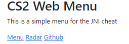
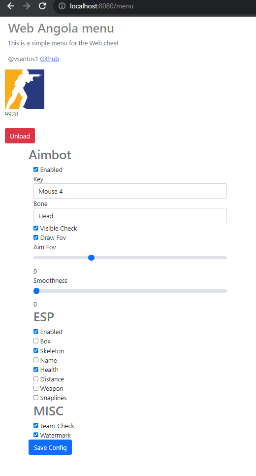

# CS2 - External

Project made with C++ and Java, using [JNI](https://pt.wikipedia.org/wiki/Java_Native_Interface) , CS2 gaming chair with `Engine` built in C++ and Web  running with Java.

Must have the following tools
- [CMAKE](https://cmake.org/)
- [MSVC compiler](https://visualstudio.microsoft.com/downloads/) 
- [Maven](https://maven.apache.org/download.cgi)

# How to build

### Before executing those commands, make sure you're running the commands on right folder directory

## Engine
Debug
```
cmake -S engine -B engine/build
cmake --build engine/build --config Debug --target ALL_BUILd -j 14
```
Release
```
cmake -S engine -B engine/build
cmake --build engine/build --config Release --target ALL_BUILd -j 14
```
## Web

```
mvn clean package -DSkipTests=True
```
# Running the cheetos

> [!WARNING]  
> ⚠ engine.dll and web.jar must be placed in same folder, 

> If everything is okay, should be displayed `ProcessId` below cs2 image

Open the browser and type `http://localhost:8080`

> Home



> Menu 
 


